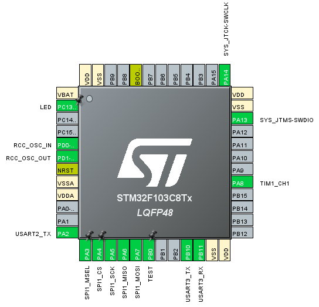
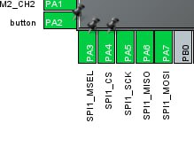
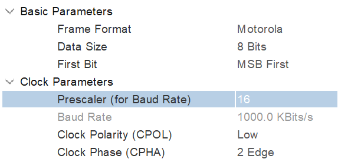
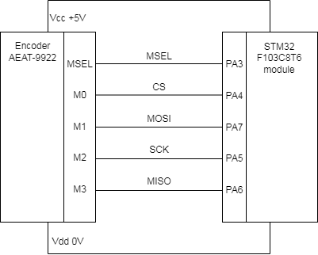

# AEAT-9922

## 1. Wiring
For this project, STM32 pins are configured as following:

     

For communicating with encoder, SPI should be set in Full-Duplex Master mode.
SPI pins:

     

SPI setup:

     

AEAT9922 to STM32 connection scheme:

     

## 2. Setup

Since the MX_GPIO_Init() sets the SPI1_CS_Pin and SPI1_MSEL_Pin to GPIO_PIN_RESET, it is crucial to place

HAL_GPIO_WritePin(SPI1_CS_GPIO_Port, SPI1_CS_Pin, GPIO_PIN_SET);
HAL_GPIO_WritePin(SPI1_MSEL_GPIO_Port, SPI1_MSEL_Pin, GPIO_PIN_SET);

after the MX_GPIO_Init(), or replace setup_spi() to be called after MX_GPIO_Init()

## 3. Functions
### write_resolution(data)
Writes resolution from 10 to 18 bits

### read_resolution()
Returns resolution

### spi_read(uint8_t reg)
reads data from specified register
spi_read(0x3f)*360.0/262144.0 - returns angle (according to stored zero position)

### set_zero()
Writes current absolute position to the 0x12 register, after that returns angle taking this value into account
